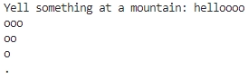
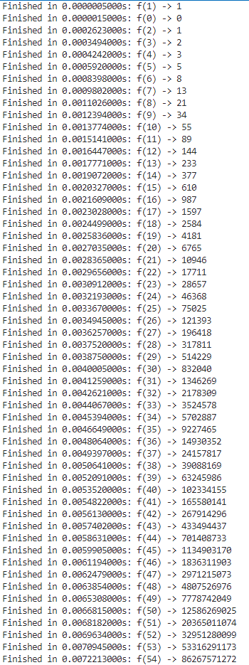

# CS3980-A1
# Assignment 1: Python Refresher

# Introduction
This repository contains my solutions for the Assignment 1: Python Refresher for CS:3980:0001 Spr24. It includes two main parts: 
1. An `echo.py` script that imitates a real-world echo.
2. A `fib.py` script that calculates the Fibonacci sequence with optimized execution time using decorators.

---

# Part 1: Python Programming Basics - Echo

The `echo.py` file contains a function that simulates an echo. Given a word or phrase, it prints the "echo" of the word, with each repetition losing the last character to create a fading effect.

# Example Output

Yell something at a mountain: Helloooo
ooo
oo
o
.
---

# Part 2: Python Decorator Implementation - Fibonacci Sequence

The `fib.py` script calculates the nth Fibonacci number using a recursive function. To improve performance, it utilizes the `lru_cache` decorator to cache results of function calls.

# Optimizations
- **`lru_cache`**: Caches the results of the expensive recursive calls.
- **Timer Decorator**: Measures the execution time of each call.

# Timing Output

Finished in 0.0000005000s: f(1) -> 1
Finished in 0.0000015000s: f(0) -> 0
Finished in 0.0002623000s: f(2) -> 1
Finished in 0.0003494000s: f(3) -> 2
Finished in 0.0004242000s: f(4) -> 3
Finished in 0.0005920000s: f(5) -> 5
Finished in 0.0008398000s: f(6) -> 8
Finished in 0.0009802000s: f(7) -> 13
Finished in 0.0011026000s: f(8) -> 21
Finished in 0.0012394000s: f(9) -> 34
Finished in 0.0013774000s: f(10) -> 55
Finished in 0.0015141000s: f(11) -> 89
Finished in 0.0016447000s: f(12) -> 144
Finished in 0.0017771000s: f(13) -> 233
Finished in 0.0019072000s: f(14) -> 377
Finished in 0.0020327000s: f(15) -> 610
Finished in 0.0021609000s: f(16) -> 987
Finished in 0.0023028000s: f(17) -> 1597
Finished in 0.0024499000s: f(18) -> 2584
Finished in 0.0025836000s: f(19) -> 4181
Finished in 0.0027035000s: f(20) -> 6765
Finished in 0.0028365000s: f(21) -> 10946
Finished in 0.0029656000s: f(22) -> 17711
Finished in 0.0030912000s: f(23) -> 28657
Finished in 0.0032193000s: f(24) -> 46368
Finished in 0.0033670000s: f(25) -> 75025
Finished in 0.0034945000s: f(26) -> 121393
Finished in 0.0036257000s: f(27) -> 196418
Finished in 0.0037520000s: f(28) -> 317811
Finished in 0.0038750000s: f(29) -> 514229
Finished in 0.0040005000s: f(30) -> 832040
Finished in 0.0041259000s: f(31) -> 1346269
Finished in 0.0042621000s: f(32) -> 2178309
Finished in 0.0044067000s: f(33) -> 3524578
Finished in 0.0045394000s: f(34) -> 5702887
Finished in 0.0046649000s: f(35) -> 9227465
Finished in 0.0048064000s: f(36) -> 14930352
Finished in 0.0049397000s: f(37) -> 24157817
Finished in 0.0050641000s: f(38) -> 39088169
Finished in 0.0052091000s: f(39) -> 63245986
Finished in 0.0053520000s: f(40) -> 102334155
Finished in 0.0054822000s: f(41) -> 165580141
Finished in 0.0056130000s: f(42) -> 267914296
Finished in 0.0057402000s: f(43) -> 433494437
Finished in 0.0058631000s: f(44) -> 701408733
Finished in 0.0059905000s: f(45) -> 1134903170
Finished in 0.0061194000s: f(46) -> 1836311903
Finished in 0.0062479000s: f(47) -> 2971215073
Finished in 0.0063854000s: f(48) -> 4807526976
Finished in 0.0065308000s: f(49) -> 7778742049
Finished in 0.0066815000s: f(50) -> 12586269025
Finished in 0.0068182000s: f(51) -> 20365011074
Finished in 0.0069634000s: f(52) -> 32951280099
Finished in 0.0070945000s: f(53) -> 53316291173
Finished in 0.0072213000s: f(54) -> 86267571272
Finished in 0.0073630000s: f(55) -> 139583862445
Finished in 0.0075045000s: f(56) -> 225851433717
Finished in 0.0076395000s: f(57) -> 365435296162
Finished in 0.0077765000s: f(58) -> 591286729879
Finished in 0.0079212000s: f(59) -> 956722026041
Finished in 0.0080585000s: f(60) -> 1548008755920
Finished in 0.0081939000s: f(61) -> 2504730781961
Finished in 0.0083292000s: f(62) -> 4052739537881
Finished in 0.0084647000s: f(63) -> 6557470319842
Finished in 0.0086093000s: f(64) -> 10610209857723
Finished in 0.0087484000s: f(65) -> 17167680177565
Finished in 0.0088803000s: f(66) -> 27777890035288
Finished in 0.0090298000s: f(67) -> 44945570212853
Finished in 0.0091722000s: f(68) -> 72723460248141
Finished in 0.0093128000s: f(69) -> 117669030460994
Finished in 0.0094542000s: f(70) -> 190392490709135
Finished in 0.0095922000s: f(71) -> 308061521170129
Finished in 0.0097333000s: f(72) -> 498454011879264
Finished in 0.0098703000s: f(73) -> 806515533049393
Finished in 0.0100340000s: f(74) -> 1304969544928657
Finished in 0.0101916000s: f(75) -> 2111485077978050
Finished in 0.0103314000s: f(76) -> 3416454622906707
Finished in 0.0104538000s: f(77) -> 5527939700884757
Finished in 0.0105802000s: f(78) -> 8944394323791464
Finished in 0.0107150000s: f(79) -> 14472334024676221
Finished in 0.0108436000s: f(80) -> 23416728348467685
Finished in 0.0109716000s: f(81) -> 37889062373143906
Finished in 0.0111043000s: f(82) -> 61305790721611591
Finished in 0.0112527000s: f(83) -> 99194853094755497
Finished in 0.0114060000s: f(84) -> 160500643816367088
Finished in 0.0115618000s: f(85) -> 259695496911122585
Finished in 0.0117170000s: f(86) -> 420196140727489673
Finished in 0.0118577000s: f(87) -> 679891637638612258
Finished in 0.0119906000s: f(88) -> 1100087778366101931
Finished in 0.0121423000s: f(89) -> 1779979416004714189
Finished in 0.0122975000s: f(90) -> 2880067194370816120
Finished in 0.0124281000s: f(91) -> 4660046610375530309
Finished in 0.0125526000s: f(92) -> 7540113804746346429
Finished in 0.0126837000s: f(93) -> 12200160415121876738
Finished in 0.0128302000s: f(94) -> 19740274219868223167
Finished in 0.0129652000s: f(95) -> 31940434634990099905
Finished in 0.0130916000s: f(96) -> 51680708854858323072
Finished in 0.0132259000s: f(97) -> 83621143489848422977
Finished in 0.0133601000s: f(98) -> 135301852344706746049
Finished in 0.0135016000s: f(99) -> 218922995834555169026
Finished in 0.0136379000s: f(100) -> 354224848179261915075

# How to Run the Code
1. Clone this repository.
2. Navigate to the cloned directory.
3. Run `python echo.py` or `python fib.py` to execute the scripts.

---

# Feedback
I appreciate any feedback or suggestions for improvement.

---

# Contact Information
- Name: JB (Jeongbeom) Lee
- Email: [jeongbeom98@gmail.com](mailto:jeongbeom98@gmail.com)